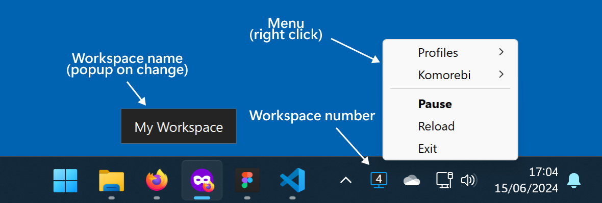

#  Komorebi Tray

A tray app to manage komorebi tiling window manager for Windows.

- Show the current **workspace number** on tray icon.
- Show **workspace name** popup on workspace change.
- Start/Stop/Pause komorebi using the tray menu.
- Click on the tray icon to Pause/Resume komorebi.

Komorebi can be started, stopped and paused externally and the app will adjust accordingly: **it works independently from komorebi** and does not require any change to your current komorebi configuration (see [Quick start](#quick-start)).

If the app is already running but the connection with komorebi is lost, the app will wait for komorebi to start. If the app is started but komorebi has not been launched yet, the app will attempt to launch komorebi. This is useful if you want to use this app as a _launcher_ for Komorebi at Windows startup.



## Quick start

Install Komorebi Tray using the latest [MSI Windows Installer](https://github.com/Sylbird/komorebi-tray/releases/latest).

No changes to your default komorebi configuration are needed. The only requirement is to set the `KOMOREBI_CONFIG_HOME` environment variable for your user, which is used to read the current komorebi configuration and for multiple AutoHotkey profile management.

```powershell
# Set KOMOREBI_CONFIG_HOME for the user
[System.Environment]::SetEnvironmentVariable("KOMOREBI_CONFIG_HOME", "$($Env:USERPROFILE)\.config\komorebi", "User")

# Check your current settings
[System.Environment]::GetEnvironmentVariable("KOMOREBI_CONFIG_HOME", "User")
```

For more information, see the official [Komorebi docs](https://lgug2z.github.io/komorebi/common-workflows/komorebi-config-home.html).
